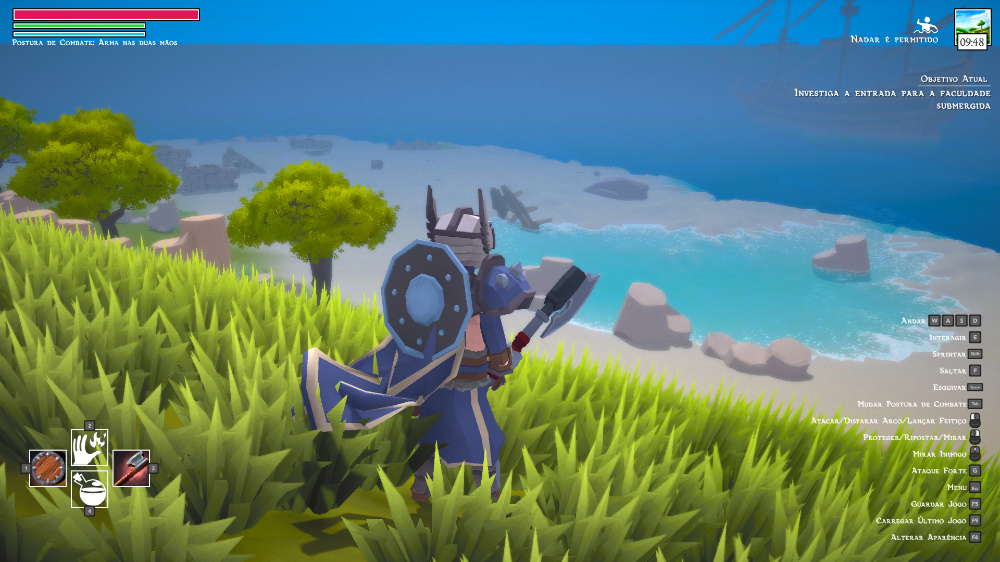
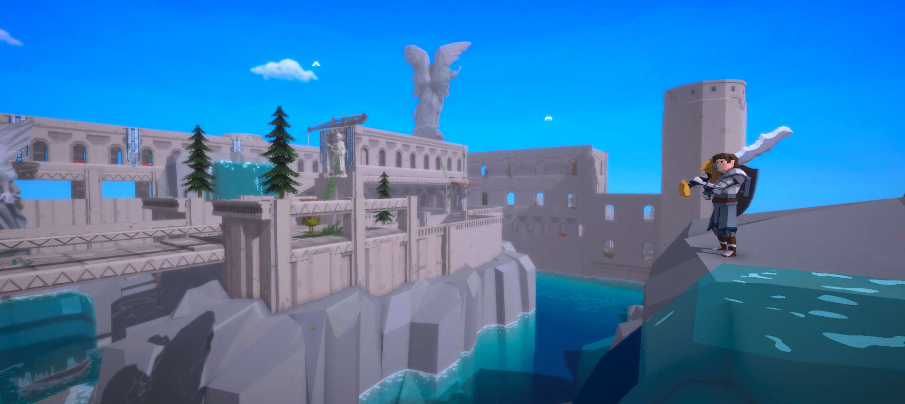

# Cacildes Adventure

**A light-hearted soulslike about a kid and his journey to join the king's army** 🎮

---

## 🗓️ Release

- **Full Version**: Launched April 27, 2024 on Steam, for Windows

---

## 📚 Documentation Outline

- **Installation**  
  Clone the repo, import the Unity project, and run scene `Cacildes Home`. That is the intro scene when the game loads, and also where you can find the Title Screen.

---

## 🛠️ Contributing

This is a solo project. I share all the source code and welcome any suggestions to improve it!

If you do find bugs playing the game or spotting some wrong logic in the code, feel free to open an issue! Any help is appreciated.

- 🐛 Issue tracker for bug reports & feature requests

---

## 🧩 Team

- **Developer/Publisher**: André Fernandes (https://bsky.app/profile/andrefcasimiro.bsky.social)

---

## 🎉 Community & Support

- **Discord**: https://discord.com/invite/JwnZMc27D2

---

